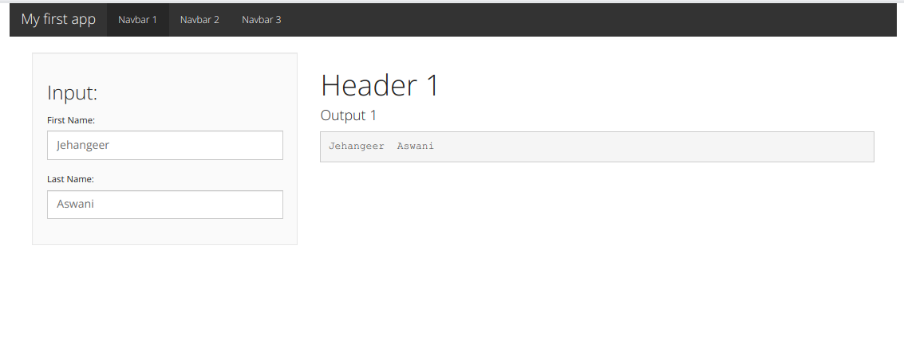
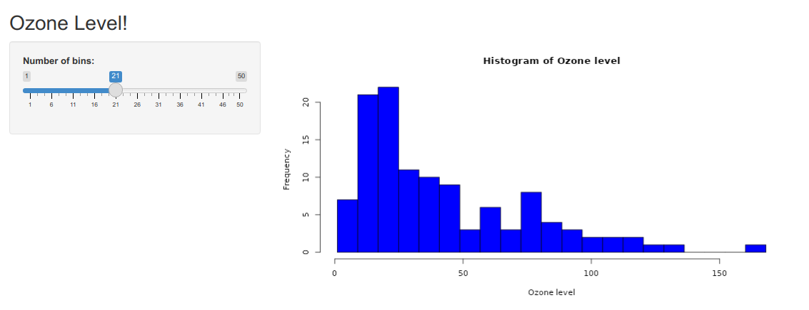
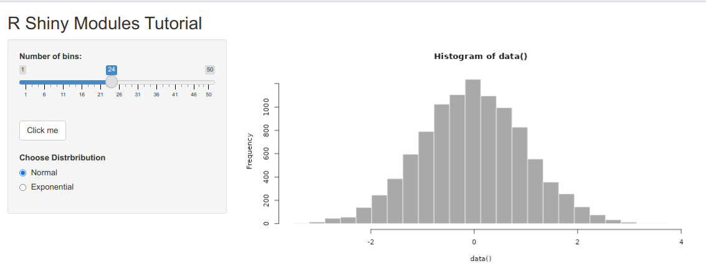

# R Shiny Learning Repository

This repository serves as a learning hub for building interactive web applications using R Shiny. As I progress in my R Shiny journey, I will be creating and adding Shiny apps to this repository, showcasing various features, concepts, and improvements.

## App: 01

This Shiny app is a basic example with a navbar and input fields to capture first and last names, showcasing how to render the concatenated full name as an output.

- [Check out the code here!](myfirstshinyapp.R)

## App: 02

This Shiny app, allows users to visualize the distribution of ozone levels using a histogram. Users can adjust the number of bins in the histogram using a slider input, providing a dynamic view of the ozone level distribution.

- [Check out the code here!](simplehistogram.R)

## App: 03

This Shiny application serves as a tutorial showcasing the effective use of Shiny modules. By utilizing modular programming, we've organized the app into independent, reusable components, enhancing code maintainability and reusability.

- [Check out the code here!](shiny_modules_app/modules_app.R)

